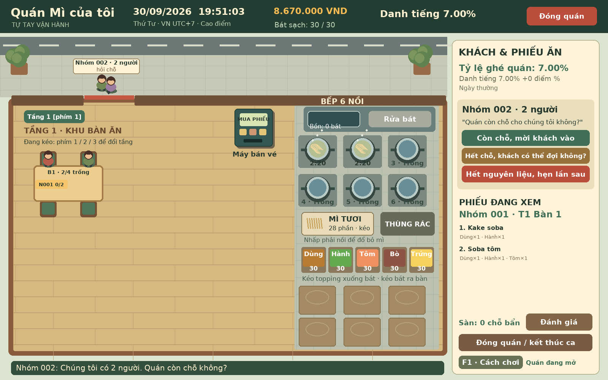

<h1 align="center">Quán Mì Của Tôi</h1>

<strong>Một quán nhỏ. Từng bát mì. Câu chuyện của bạn.</strong>

Game mô phỏng kinh doanh quán mì bằng tiếng Việt, tự tay thao tác bằng chuột.

<a href="https://quan-mi-cua-toi-web.dovanphit1.chatgpt.site"><strong>🍜 Chơi trên web</strong></a> &nbsp; · &nbsp; <a href="https://github.com/dovanphit1-creator/Qu-n-soba/releases/download/1.7.1/QuanMiCuaToi-Setup.exe"><strong>↓ Tải Windows (.exe)</strong></a> &nbsp; · &nbsp; <a href="https://github.com/dovanphit1-creator/Qu-n-soba/releases">Các bản phát hành</a>

## Tự tay chăm sóc quán của bạn

- **Đón từng nhóm khách:** trả lời còn chỗ hay phải đợi, nhận phiếu ăn, kéo khách đến bàn và ghép chỗ khi cần.
- **Nấu từng bát mì:** 6 nồi bếp, thời gian luộc 3 phút 30 giây; vớt kịp, thêm topping rồi phục vụ đúng bàn.
- **Giữ quán sạch sẽ:** thu bát, bấm rửa, lau bàn và dọn quán trước khi đóng cửa.
- **Xây dựng quán riêng:** mua bàn ghế, mở rộng tối đa 3 tầng, tự tạo menu và tính giá vốn mỗi món.
- **Quản lý nguồn hàng:** hợp đồng nhà cung cấp giảm 3% so với mua lẻ; đặt trước 23 giờ để giao lúc 8 giờ sáng hôm sau.
- **Theo dõi kinh doanh:** tiền VND, giờ và lịch Việt Nam, báo cáo theo ngày, tháng, năm.

Bạn bắt đầu với **10.000.000 VND**, **7% danh tiếng**, **1 bàn 4 chỗ** và **kho trống**. Mua bát đĩa, mì và topping trước khi mở cửa đón khách đầu tiên.

## Chọn phiên bản

| | Web | Windows |
|---|---|---|
| Bắt đầu | Mở link và chơi trên trình duyệt | Tải bộ cài `.exe`, cài đặt rồi mở game; không cần Python |
| Tiến trình | Không lưu; tải lại hoặc đóng trang là chơi lại | Tự lưu trên máy, lần sau tiếp tục |
| Thiết bị | Máy tính có chuột và bàn phím | Máy tính Windows |
| Chi phí | Miễn phí | Miễn phí |

Bản Windows lưu trong `%LOCALAPPDATA%\QuanSobaManual\save-vnd.json`. Hai phiên bản không đồng bộ dữ liệu.

Bản chính thức mới nhất là **1.7.1**. Người chơi bản 1.0.0 có tính năng kiểm tra cập nhật sẽ nhận thông báo khi mở game có Internet. Tệp Windows chưa ký số nên có thể xuất hiện cảnh báo nhà phát hành.

## Góp ý và cập nhật

Báo lỗi hoặc góp ý tại [Issues](https://github.com/dovanphit1-creator/Qu-n-soba/issues). Xem tệp tải và phiên bản tại [Releases](https://github.com/dovanphit1-creator/Qu-n-soba/releases).

## Trang giới thiệu và mã nguồn

- Trang giới thiệu hoàn chỉnh nằm trong [`docs/`](docs/). Xem [hướng dẫn bật GitHub Pages](GITHUB_PAGES.md).
- Mã nguồn game giao diện và quy trình đóng gói Windows hiện ở nhánh [`build-windows-app`](https://github.com/dovanphit1-creator/Qu-n-soba/tree/build-windows-app).
- `soba_game.py` trên nhánh `main` là bản dòng lệnh ban đầu, được giữ lại để tham khảo.

Bản 1.3.0 thêm nhân viên, ca làm, lịch nghỉ, lương / bảo hiểm / thuế mô phỏng; đồ uống, topping, chuông báo mì chín và đánh giá 0–5 sao. Nhân sự → Chạy nền bật Windows chạy nền khi máy còn bật. Bản web vẫn không lưu.

Bản 1.3.0 bổ sung máy chấm công baito và tăng ca chính thức, ca chuẩn 8h + 30p nghỉ không tính công, đăng bài tuyển / CV, bảng khoảng giờ thiếu người theo vị trí, lời mời baito làm thay và quyết định chủ tự làm hoặc cho quán nghỉ. Giữ dữ liệu 1.2.0, sao lưu khi chuyển đổi.

Bản 1.3.1 sửa khách mắc kẹt khi hết nguyên liệu: chọn nhóm đang chờ → Hoàn tiền & mời khách về → xác nhận. Hoàn toàn bộ phiếu, không hoàn hai lần; doanh thu và lợi nhuận đã trừ tiền hoàn. Giữ dữ liệu 1.3.0.

Bản 1.3.2 sửa chuyển màn hình khi nhân viên tự mở quán đúng ca; tự đưa người chơi vào giao diện quán đang mở và thêm nút quay lại quán trong Nhân sự. Giữ nguyên dữ liệu lưu.

Bản 1.4.0 cho baito hỗ trợ toàn bộ bếp. Nhân sự → Nhân viên / ca → Hỗ trợ bếp: BẬT/TẮT theo từng người, mặc định bật. Horu vẫn là vị trí chính; ca làm, chấm công, lương và dữ liệu lưu được giữ nguyên.

Bản 1.5.0 ưu tiên vị trí chính của nhân viên; chỉ hỗ trợ khi vị trí kia thiếu người hoặc quá tải. Giữ chuột để rửa / lau, nhân viên xử lý hết nguyên liệu và ghi báo cáo tiền ứng mua lẻ. Có giọng đọc tiếng Việt đi kèm, khách lấy thẻ chờ hoặc rời đi nếu vội, thời gian chọn món giảm 50%, thống kê số người vào và điểm sao trung bình theo ngày / tháng / năm.

Bản 1.6.0: lương mong muốn trong CV cố định sau tuyển. Tab Chi phí quản lý đồng hồ điện, nước, ga, đơn vị cung cấp, hóa đơn và hạn trả; tiền thuê mặt bằng phố 5 / 10 / 18 triệu VND/tháng, thuế mô phỏng 10% lợi nhuận dương năm trước, 4 kỳ tháng 6 / 8 / 10 / 12. Chi phí và thanh toán ghi riêng để không tính hai lần.

Bản 1.6.1 sửa tự mở khi nhân viên đến ca: bổ sung kho sau khi hết nguyên liệu sẽ mở lại trong cùng ngày, chuyển đúng màn hình và hiển thị lý do chưa mở. Giữ lựa chọn nghỉ kinh doanh / mở thủ công của chủ quán.

Bản 1.7.0: Nhân sự → Tạo / đăng ký ca để tạo ca riêng và xem nguyện vọng theo ngày. Baito chọn ca hằng ngày, nhiều lần nghỉ không tính công. Chính thức chốt ca trong CV, làm đủ 8 giờ và chỉ nghỉ một lần giữa ca; tăng ca đặt riêng. Bảng thiếu người tính cả các khoảng nghỉ.

Bản 1.7.1 sửa nhân viên bỏ sót kho hết hàng khi không có đơn chờ: mua thêm bằng tiền ứng hoặc hoàn phiếu, dọn sạch và đóng sớm. Nhân viên tiếp tục lau/rửa bỏ dở; không tự mở lại bằng lượng nguyên liệu cũ. Giữ ca, hợp đồng, lương và tiến trình.
